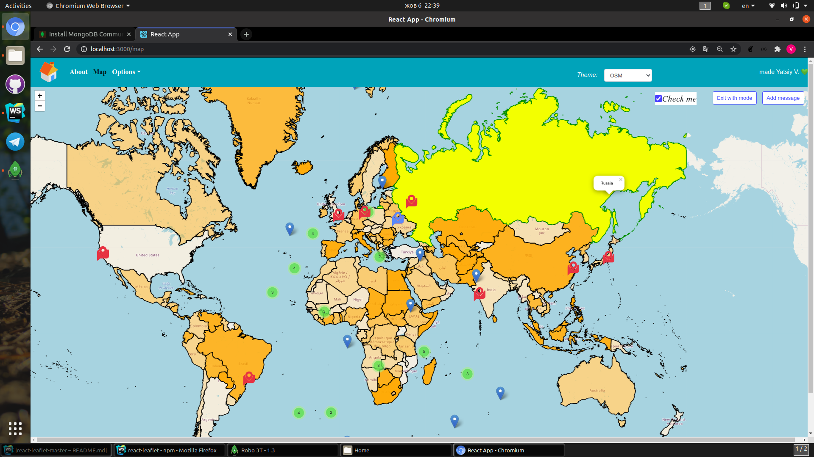
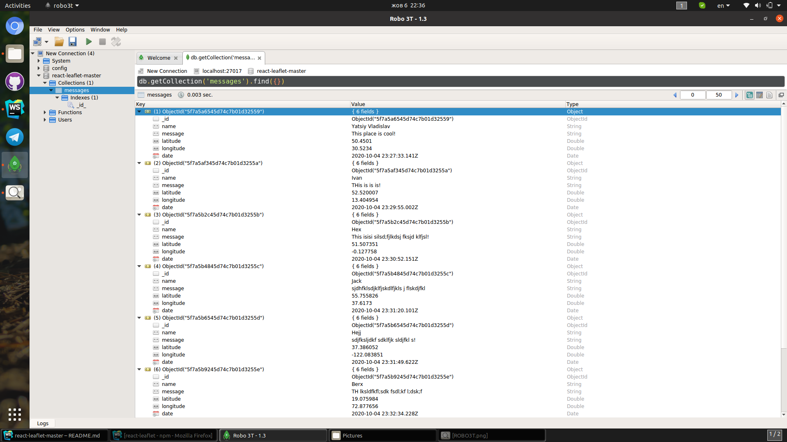

# MERN leaflet

[](https://www.npmjs.com/package/react-leaflet)
[](https://www.npmjs.com/package/react-leaflet)
<br/>
React wrapper of [react-leaflet](https://github.com/PaulLeCam/react-leaflet)



# Description
This application uses the mongodb database that automatically connects to your database, but for this you must have the database client loaded on your pc, below there will be a link to install the database.
Choose the operating system you need on your pc, maybe it's Windows or Linux.
If you are using Linux as I am, then install the Robo3t application, through it you can conveniently use the database

# GETTING STARTED
**1.** Download MongoDB:

```bash
https://docs.mongodb.com/manual/administration/install-community/
```
**2.** I advise you to install to optimize the database:

```bash
https://robomongo.org/download
```
# How to run DEV env

**1.** Clone the repo:

```bash
git clone https://github.com/lexun1060/mern-leaflet.git
```

**2.** Install all dependencies:

```bash
cd client
npm install # npm
```

**3.** Start the server:

```bash
cd ..
cd server
npm install
npm run dev # npm
```

**4.** After starting the server, storybook should automatically open the following address:

```
http://localhost:3000/
```

